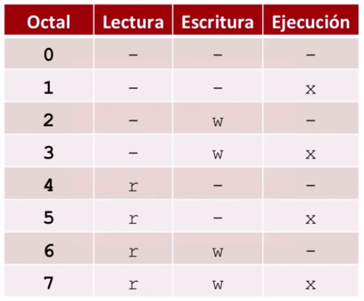

# Permisos de archivos Linux / Unix

## Existen tres tipos de permisos basicos

r: (read) Este permiso nos permite leer el contenido del fichero, y en caso de que sea un directorio nos permite listar su contenido.

w: (write) Con este permiso el usuario puede escribir o modificar el fichero y para los directorios puede crear ficheros en este o crear directorios nuevos dentro de este.

x: (execute) Los usuarios con este permiso pueden ejecutar los ficheros si son programas ejecutables y en caso de directorios dichos usuarios pueden cambiar al directorio por otra cosa.

## Doferetes tipos de roles (3 niveles)

- Propietario: El creado del archivo o directorio en cuestion.
- Grupo: Es el grupo al cual pertenece el propietario.
- Otros: Son los otros usuarios del sistema.

## Aplicacion

Los sistemas aplican los permisos distribuidos en una cadena de 10 caracteres de las siguiente manera:


Ej: si un directorio tiene solo acceso su credor su distribución de permisos se veria de la siguiente manere:

d r w x _ _ _ _ _ _

<b>Nota:</b> Solo se pueden cambiar los permisos de un archivo o directorio si es su propietario o si el usuario <b>root</b>

## Cambiar los permisoso de un fichero o directorio, se utiliza el comando "chmod"

```shell
chmod {a,u,g,o} {+,-} {r,w,x}
```

El primer bloque de chmod es a que usuario se le asignaran o quitan los permisos.

- a: (all) todos los usuarios del sistema.
- u: (user) propietario.
- g: (group) grupo al cual pertenece el propietario.
- o: (other) los otros usuarios del sistema.

El segundo bloque es asignación o remoción.

- +: Asigna al usuario dicho permiso.
- -: Quita al usuario o usuarios dicho permiso.

El tercer bloque son los permisos que se asignaran.

- r: Read.
- w: Write.
- x: Execute.

## Ejemplos de uso

```shell
chmod a+r fichero
```
Esto quiere decir que a todos los usuarios del sistema se le aplicaran los pemisos de lectura con relación al archivo que se pasa por parametro.

```shell
chmod og-x fichero
```
Esto quiere decir que al a los otros y al grupo se le quita el permiso de ejecución con relación al fichero.

```shell
chmod u+rwx fichero
```
Esto quiere decir que al propietario del archivo se le da permisos de Lectura, Escritura y ejecución.

## Uso de "chmod" con codigos numericos en octal

Esta manera consiste en una manera rapida de asignar los permisos a los usuarios.

Tenemos la siguiente tabla donde se distribuyen los permisos asignando a un numero.



Como se utiliza:

```shell
chmod {numero asignado a u} {No. asignado a g} {No. asignado a o} fichero
```

Ejemplo de uso

```shell
// Este le quita todos los permisos a los usuarios
chmod 000 fichero  

// Este le da permiso de escritura y ejecución al usuario pero no lectura.
// Este le da permiso de lectura y ejecución pero no escritura al grupo.
// Este le da permiso de lectura, escritura, pero no de ejecución a los demas usuarios.
// ** Esto solo es un ejemplo ya que no tiene mucha logica.
chmod 356 fichero  

// Permiso de lectura y escritura al usuario no de ejecución
// Permiso de lectura al grupo
// Permiso de lectura a los otros
chmod 644 fichero
```
